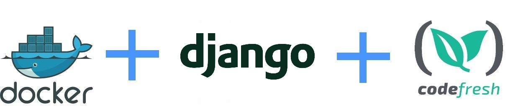

# Dockerized Django application



This is an example Python application that uses Django, pip and Docker.
It is packaged using Codefresh.

More details can be found in [the documentation page](https://codefresh.io/docs/docs/learn-by-example/python/django/).


## Instructions

To install dependencies 

```
pip install -r requirements.txt 
```

## To run tests

```
python -m unittest composeexample.utils
```

## To run the webapp manually

```
python manage.py runserver 0.0.0.0:8000
```

....and navigate your browser to  http://localhost:8000/

## To create a docker image

```
docker build -t django-app .
```


## To run the docker image

```
docker run -p 8000:8000 django-app
```


## To use this project in Codefresh 

There is also a [codefresh.yml](codefresh.yml) for easy usage with the [Codefresh](codefresh.io) CI/CD platform.


Enjoy!


